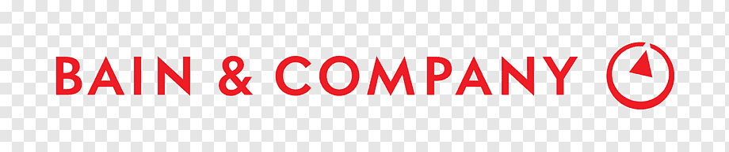

<!DOCTYPE html>
<html lang="en">
<head>
    <meta charset="UTF-8">
    <meta name="viewport" content="width=device-width, initial-scale=1.0">
    <title>Avinash Gupta - Resume</title>
    <link rel="stylesheet" href="styles.css">
    
</head>
<body>
    <header>
        <h1>Avinash Gupta</h1>
        <nav>
            <ul>
                <li><a href="#about">About</a></li>
                <li><a href="#work-experience">Work Experience</a></li>
                <li><a href="#resume">Resume</a></li>
                <li><a href="#portfolio">Portfolio</a></li>
                <li><a href="#contact">Contact</a></li>
            </ul>
        </nav>
    </header>
    
    <section id="about">
        <h2>About Me</h2>
        

            
            
Hi, I'm Avinash Gupta

        

    </section>
    
    <section id="work-experience">
        <h2>Work Experience</h2>
        

            

                

                    

                        
                    

                    <h3>Bain & Company, Gurugram, India</h3>
                    
Summer Associate (04/2023 – 06/2023)

                    <ul>
                        <li>Engaged in the B2C Pricing CoE and utilized Python and ML algorithms for KVI classification in the Retail Domain</li>
                        <li>Developed 5+ VBA dashboard to assess impact (units/revenue/margin) of shifting to user-recommended price index</li>
                        <li>Streamlined the entire process, enabling the business to generate their own product classification at a half-yearly basis</li>
                        <li>Created a summary deck consisting of 15 slides outlining the methodology, end-to-end process, and actionable insights</li>
                    </ul>
                

                

                    

                        
                    

                    <h3>Axtria, Gurugram, India</h3>
                    
Associate (03/2022 – 05/2022)

                    <ul>
                        <li>Contributed to ETL-based projects across 8+ Life Science subject areas within the Business Intelligence Management team</li>
                        <li>Attained consistent performance exceeding expectations and meeting 99% of the KPIs, resulting in successive promotions</li>
                    </ul>
                

                <!-- Add more timeline items as needed -->
            

        

    </section>
    
    <section id="resume">
        <h2>Resume</h2>
        
Download my resume:

        
<a href="https://drive.google.com/file/d/1AGNA0EBOOxe64iFeyf4fMO5ag0PJGkSN/view?usp=sharing" target="_blank">Download PDF</a>

    </section>
    
    <section id="portfolio">
        <h2>Portfolio</h2>
        <!-- Add your portfolio projects here -->
        <!-- Include project descriptions, images, links, etc. -->
    </section>
    <section id="contact">
    <h2>Contact Me</h2>
    

        

            
            LinkedIn
        

        

            
            +91-9884206218
        

        

            
            toavinashgupta@gmail.com
        

    

</section>   
    <footer>
        
&copy; 2024 Avinash Gupta. All rights reserved.

    </footer>
</body>
</html>
