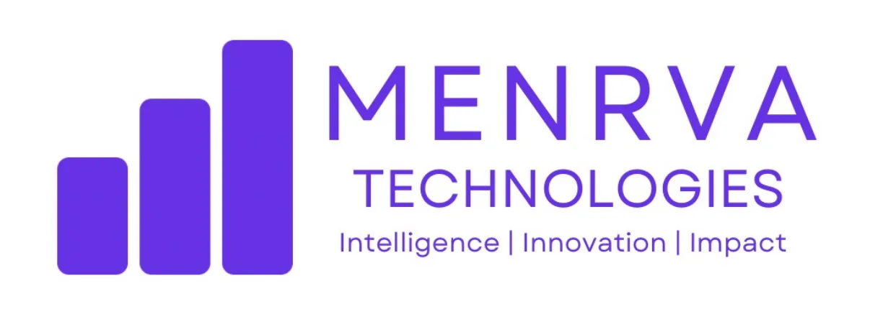
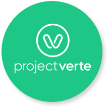

<!DOCTYPE html>
<html lang="en">
<head>
    <meta charset="UTF-8">
    <meta name="viewport" content="width=device-width, initial-scale=1.0">
    <title>Avinash Gupta - Resume</title>
    
</head>
<body>
    

        

            

                <h2>Portfolio</h2>
                <!-- Add portfolio content here -->
            

            

                <h2>Resume</h2>
                
View my resume:

                
Click here

            

            

                <h2>Contact Me</h2>
                 

            

                
                LinkedIn
            

            

                
                +91-9884206218
            

            

                
                toavinashgupta@gmail.com
            

        

        

            

                <h2>Work Experience</h2>
                

                    
                    
                

            

            

                <h2>Internship Experience</h2>
                

                    
                    
                    
                    
                

            

            

                <h2>Education</h2>
                

                    
                    
                

            

        

    

    <footer>
        
&copy; 2024 Avinash Gupta. All rights reserved.

    </footer>
</body>
</html>
